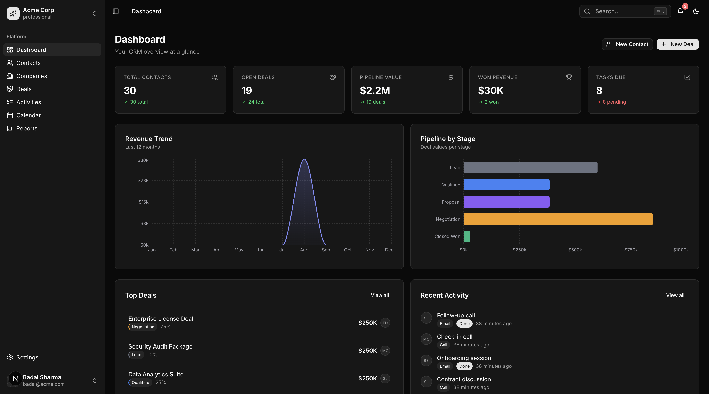
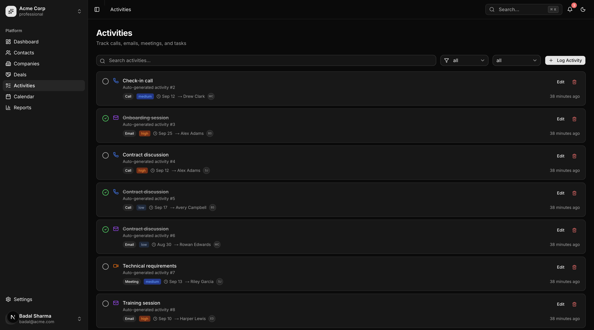
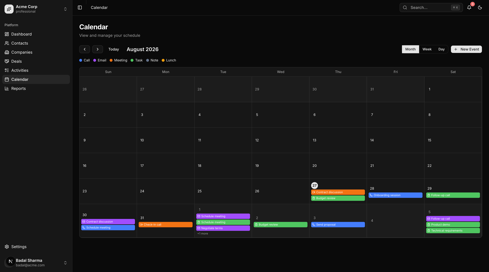
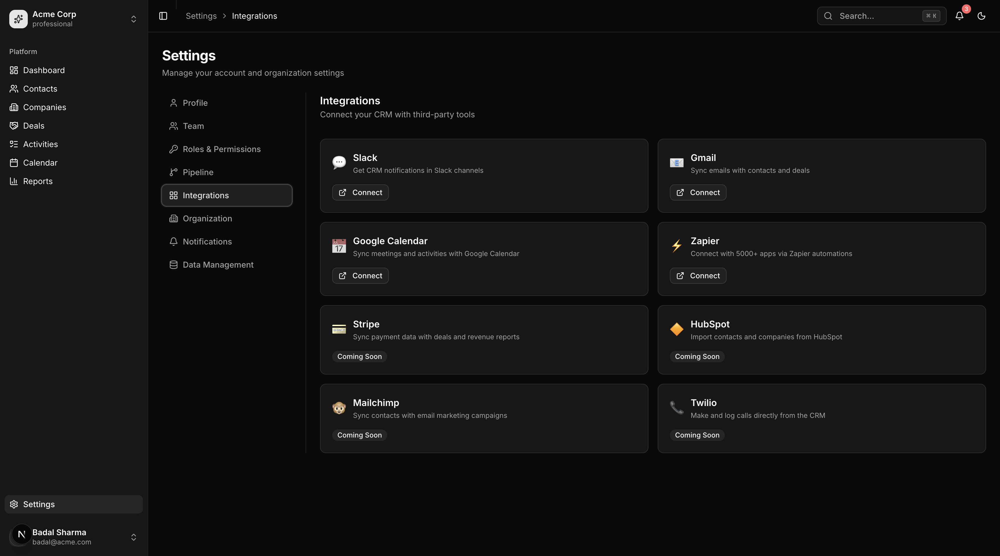

<p align="center">
  <h1 align="center">NextCRM</h1>
  <p align="center">
    A modern, open-source CRM built with Next.js 16 and FastAPI.
    <br />
    Manage contacts, companies, deals, and pipelines — all in one place.
  </p>
</p>

<p align="center">
  <a href="#features">Features</a> &middot;
  <a href="#tech-stack">Tech Stack</a> &middot;
  <a href="#quick-start">Quick Start</a> &middot;
  <a href="#screenshots">Screenshots</a> &middot;
  <a href="#architecture">Architecture</a> &middot;
  <a href="#contributing">Contributing</a> &middot;
  <a href="#license">License</a>
</p>

<p align="center">
  <a href="https://github.com/sharmabadal15/nextcrm-opensource/stargazers">
    
  </a>
  <a href="https://github.com/sharmabadal15/nextcrm-opensource/blob/main/LICENSE">
    
  </a>
  
  
  
  
</p>

---

## Screenshots

<p align="center">
  
  <br />
  <em>Dashboard — KPI cards, revenue trends, pipeline overview, top deals & recent activity</em>
</p>

<details>
<summary><strong>More screenshots</strong></summary>

| Deals (Kanban Board) | Activities |
|---|---|
|  |  |

| Calendar | Settings & Integrations |
|---|---|
|  |  |

</details>

---

## Features

### Core CRM
- **Contacts** — Full CRUD, search, filters, pagination, sorting, bulk operations, CSV export
- **Companies** — Company management with linked contacts and deals
- **Deals** — Kanban pipeline board with drag-and-drop + list view toggle
- **Activities** — Track calls, emails, meetings, tasks with priority levels and completion toggle
- **Calendar** — Month, week, and day views with color-coded activity types
- **Reports** — Pipeline, revenue, activity, and sales performance analytics with charts

### Productivity
- **Dashboard** — KPI cards, revenue trends, pipeline overview, recent activity feed
- **Global Search** — `Cmd+K` command palette searches across contacts, companies, and deals
- **Keyboard Shortcuts** — Full shortcut system (`?` to view all shortcuts)
- **Rich Text Notes** — Tiptap editor with formatting, links, and mentions
- **File Attachments** — Drag-and-drop upload with progress tracking
- **CSV Import/Export** — 4-step import wizard with column mapping and validation
- **Notifications** — In-app notification system with unread badges

### Settings & Administration
- **Team Management** — Invite members, assign roles (Admin / Manager / Sales Rep / Viewer)
- **RBAC** — Role-based access control with permissions matrix
- **Pipeline Configuration** — Customize stages, win percentages, and colors
- **Organization Settings** — Branding, currency, timezone configuration
- **Integration Cards** — Slack, Gmail, Google Calendar, Zapier, and more (coming soon)

### Developer Experience
- **Dark / Light Mode** — System-aware theme with manual toggle
- **Optimistic UI** — Instant feedback with TanStack Query mutations and rollback on error
- **URL-Driven State** — Filters, pagination, and search state stored in URL params
- **Loading Skeletons** — Purpose-built skeleton loaders for every view
- **Error Boundaries** — Global error and 404 pages with recovery
- **BFF Proxy** — Backend-for-Frontend pattern: all API calls go through same-origin, no CORS
- **Multi-Tenant** — Data isolation via `organization_id` on every query

---

## Tech Stack

### Frontend (`crm-app-next/`)

| Category | Technology |
|---|---|
| Framework | [Next.js 16](https://nextjs.org/) (App Router, React 19) |
| Language | TypeScript (strict mode) |
| Styling | Tailwind CSS v4 |
| Components | [shadcn/ui](https://ui.shadcn.com/) |
| Data Fetching | TanStack Query v5 |
| Tables | TanStack Table v8 |
| State | Zustand v5 |
| Forms | React Hook Form + Zod v4 |
| Charts | Recharts |
| Drag & Drop | @dnd-kit |
| Rich Text | Tiptap |
| Auth | NextAuth v5 |

### Backend (`backend/`)

| Category | Technology |
|---|---|
| Framework | [FastAPI](https://fastapi.tiangolo.com/) (async) |
| Language | Python 3.12+ |
| Database | PostgreSQL 16 + pgvector |
| ORM | SQLAlchemy 2.0 (async) |
| Migrations | Alembic |
| Cache | Redis 7 |
| Task Queue | Celery |
| File Storage | MinIO (S3-compatible) |
| Auth | JWT (python-jose + bcrypt) |

### Infrastructure

| Service | Port | Description |
|---|---|---|
| Next.js Frontend | `3000` | App UI |
| FastAPI Backend | `8000` | REST API ([Swagger](http://localhost:8000/docs)) |
| PostgreSQL | `5433` | Database |
| Redis | `6379` | Cache + Celery broker |
| MinIO Console | `9001` | File storage UI |

---

## Quick Start

### Prerequisites

- [Docker](https://docs.docker.com/get-docker/) & Docker Compose
- [Node.js 18+](https://nodejs.org/) & [pnpm](https://pnpm.io/)

### Option A: One-Command Setup (Recommended)

```bash
git clone https://github.com/sharmabadal15/nextcrm-opensource.git
cd nextcrm-opensource
./start.sh
```

This single script will:
- Check prerequisites (Docker, Node, pnpm)
- Create `.env` files from examples
- Generate `AUTH_SECRET` automatically
- Start all Docker services (PostgreSQL, Redis, MinIO, API, Celery)
- Run database migrations and seed demo data
- Install frontend dependencies
- Start the Next.js dev server

> To reset everything and start fresh: `./start.sh --fresh`

### Option B: Manual Setup

<details>
<summary>Step-by-step instructions</summary>

#### 1. Clone the repo

```bash
git clone https://github.com/sharmabadal15/nextcrm-opensource.git
cd nextcrm-opensource
```

#### 2. Start the backend

```bash
cd backend
cp .env.example .env
docker compose up -d
docker compose exec api alembic upgrade head
docker compose exec api python -m app.seed
```

#### 3. Start the frontend

```bash
cd crm-app-next
pnpm install
cp .env.example .env.local
```

Generate an auth secret and add it to `.env.local`:

```bash
openssl rand -base64 32
```

```env
# crm-app-next/.env.local
NEXT_PUBLIC_APP_URL=http://localhost:3000
NEXT_PUBLIC_APP_NAME="CRM Pro"
BACKEND_API_URL=http://localhost:8000/api/v1
AUTH_SECRET=<your-generated-secret>
```

```bash
pnpm dev
```

</details>

### Open the app

- **App:** [http://localhost:3000](http://localhost:3000)
- **API Docs:** [http://localhost:8000/docs](http://localhost:8000/docs)

**Demo login:**

```
Email:    badal@acme.com
Password: password123
```

---

## Architecture

```
nextcrm-opensource/
├── backend/                    # FastAPI Python backend
│   ├── app/
│   │   ├── main.py             # App factory, router registration
│   │   ├── config.py           # Environment settings
│   │   ├── database.py         # Async SQLAlchemy engine
│   │   ├── core/               # Security, RBAC, pagination
│   │   ├── middleware/          # Logging, tenant isolation
│   │   ├── modules/            # Domain modules (DDD pattern)
│   │   │   ├── auth/           # JWT login, register, refresh
│   │   │   ├── contacts/       # Contact CRUD
│   │   │   ├── companies/      # Company CRUD
│   │   │   ├── deals/          # Deals + Kanban stage mgmt
│   │   │   ├── pipelines/      # Pipeline + stage config
│   │   │   ├── activities/     # Activity tracking
│   │   │   ├── users/          # Team management
│   │   │   └── ...             # Notes, files, notifications, etc.
│   │   └── workers/            # Celery background tasks
│   ├── alembic/                # Database migrations
│   ├── docker-compose.yml      # PostgreSQL, Redis, MinIO, API
│   └── Dockerfile              # Multi-stage build
│
├── crm-app-next/               # Next.js 16 frontend
│   └── src/
│       ├── app/                # App Router pages
│       │   ├── (auth)/         # Login, register
│       │   ├── (dashboard)/    # All CRM pages
│       │   └── api/            # BFF proxy, NextAuth routes
│       ├── components/         # UI components
│       │   ├── layout/         # Sidebar, header, command palette
│       │   ├── shared/         # DataTable, dialogs, editors
│       │   └── ui/             # shadcn/ui primitives (28 components)
│       ├── features/           # Feature modules
│       │   ├── contacts/       # Components, hooks, schemas
│       │   ├── companies/
│       │   ├── deals/          # Kanban + list views
│       │   ├── activities/
│       │   ├── calendar/
│       │   └── reports/
│       ├── services/           # API client layer
│       ├── stores/             # Zustand state (auth, UI, notifications)
│       └── types/              # TypeScript definitions
│
└── docs/
    └── screenshots/            # App screenshots
```

### Design Principles

- **Feature-based architecture** — Each domain module is self-contained with its own components, hooks, schemas, and service layer
- **API abstraction** — Service layer decouples UI from backend; swap implementations without touching components
- **Server-first rendering** — Server components at layout level, client boundary pushed to leaf components
- **Optimistic updates** — TanStack Query mutations update cache immediately, roll back on error
- **URL as state** — Table filters, search, pagination all stored in URL search params via `nuqs`
- **Multi-tenant by default** — Every query scoped to `organization_id` from the JWT token

---

## API Overview

The backend exposes a RESTful API with Swagger documentation at `/docs`. Key endpoints:

| Module | Endpoints | Description |
|---|---|---|
| **Auth** | `POST /login`, `/register`, `/refresh`, `/me` | JWT authentication |
| **Contacts** | `GET/POST/PATCH/DELETE /contacts` | Contact management with search & filters |
| **Companies** | `GET/POST/PATCH/DELETE /companies` | Company management |
| **Deals** | `GET/POST/PATCH/DELETE /deals`, `PATCH /deals/{id}/stage` | Deal pipeline + Kanban |
| **Activities** | `GET/POST/PATCH/DELETE /activities`, `PATCH /{id}/toggle` | Activity tracking |
| **Pipelines** | `GET /pipelines` | Pipeline & stage configuration |
| **Users** | `GET/PATCH/DELETE /users` | Team management |

All endpoints support pagination (`page`, `perPage`), search, sorting (`sort[field]`, `sort[direction]`), and filtering.

---

## Development

### Backend commands

```bash
cd backend

# View logs
docker compose logs -f api

# Run tests
docker compose exec api pytest

# Create migration
docker compose exec api alembic revision --autogenerate -m "description"

# Apply migrations
docker compose exec api alembic upgrade head

# Lint
docker compose exec api ruff check .

# Stop services
docker compose down
```

### Frontend commands

```bash
cd crm-app-next

# Dev server
pnpm dev

# Type check
pnpm build

# Lint
pnpm lint

# Format
npx prettier --write .
```

---

## Roadmap

- [ ] Wire all frontend services to the real backend (currently auth is live, other modules use mock data)
- [ ] Full implementation of Notes, Files, Notifications modules
- [ ] Dashboard and Reports backend aggregation queries
- [ ] Email integration (SMTP via SendGrid / AWS SES)
- [ ] Audit logs with before/after diffs
- [ ] Custom fields (dynamic field definitions per entity)
- [ ] Tags system with tag-based filtering
- [ ] Global full-text search (PostgreSQL `tsvector`)
- [ ] Workflow automation (trigger-based actions)
- [ ] AI features — RAG chat, smart email drafts, lead scoring (pgvector + LangChain)
- [ ] Mobile-optimized API
- [ ] Multi-language support (i18n)

---

## Contributing

Contributions are welcome! Please see [CONTRIBUTING.md](CONTRIBUTING.md) for guidelines.

1. Fork the repository
2. Create your feature branch (`git checkout -b feature/amazing-feature`)
3. Commit your changes (`git commit -m 'Add amazing feature'`)
4. Push to the branch (`git push origin feature/amazing-feature`)
5. Open a Pull Request

---

## License

This project is licensed under the MIT License. See [LICENSE](LICENSE) for details.

---

<p align="center">
  Built by <a href="https://github.com/sharmabadal15">Badal Sharma</a>
</p>
